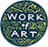

[![Contributors][contributors-shield]][contributors-url]
[![Forks][forks-shield]][forks-url]
[![Stargazers][stars-shield]][stars-url]
[![Issues][issues-shield]][issues-url]
[![MIT License][license-shield]][license-url]
[![LinkedIn][linkedin-shield]][linkedin-url]

 

  

<h3 align="center">Work of Art: Interactive</h3>

  

    An interactive home for Springboard for the Arts Work of Art: Business Skills for Artists curriculum, by Adia Morris Swanger and <a href="https://github.com/RachelNurmi91">Rachel Nurmi</a>.
     
    <a href="https://github.com/adiamorrisswanger/react-woa.git"><strong>Explore the docs »</strong></a>
     
     
    <!-- Add demo link -->
    <a href="">View Demo</a>

  

<!-- TABLE OF CONTENTS -->

  
Table of Contents

  <ol>
    <li>
      <a href="#about-the-project">About The Project</a>
      <ul>
        <li><a href="#built-with">Built With</a></li>
      </ul>
    </li>
    <li><a href="#roadmap">Roadmap</a></li>
    <li><a href="#contact">Contact</a></li>
    <li><a href="#acknowledgments">Acknowledgments</a></li>
  </ol>

<!-- ABOUT THE PROJECT -->
## About The Project

[![Product Name Screen Shot][product-screenshot]]()

(<a href="#top">back to top</a>)

### Built With

* [React.js](https://reactjs.org/)
* [Bootstrap](https://getbootstrap.com)

(<a href="#top">back to top</a>)

<!-- ROADMAP -->
## Roadmap

- [ ] User Login
- [ ] Content for registered users only
    - [ ] Downloadble workbook sections

See the [open issues](https://github.com/adiamorrisswanger/react-woa/issues) for a full list of proposed features (and known issues).

(<a href="#top">back to top</a>)

<!-- ACKNOWLEDGMENTS -->
## Acknowledgments

* 
* 
* 

(<a href="#top">back to top</a>)

<!-- CONTACT -->
## Contact

Adia Morris Swanger - [@longtallsallie](https://twitter.com/longtallsallie) - adia@adiamorris.com

Project Link: [https://github.com/adiamorrisswanger/react-woa](https://github.com/adiamorrisswanger/react-woa)

(<a href="#top">back to top</a>)

<!-- MARKDOWN LINKS & IMAGES -->
<!-- https://www.markdownguide.org/basic-syntax/#reference-style-links -->
[contributors-shield]: https://img.shields.io/github/contributors/adiamorrisswanger/react-woa.svg?style=for-the-badge
[contributors-url]: https://github.com/adiamorrisswanger/react-woa/graphs/contributors
[forks-shield]: https://img.shields.io/github/forks/adiamorrisswanger/react-woa.svg?style=for-the-badge
[forks-url]: https://github.com/adiamorrisswanger/react-woa/network/members
[stars-shield]: https://img.shields.io/github/stars/adiamorrisswanger/react-woa.svg?style=for-the-badge
[stars-url]: https://github.com/adiamorrisswanger/react-woa/stargazers
[issues-shield]: https://img.shields.io/github/issues/adiamorrisswanger/react-woa.svg?style=for-the-badge
[issues-url]: https://github.com/adiamorrisswanger/react-woa/issues
[license-shield]: https://img.shields.io/github/license/adiamorrisswanger/react-woa.svg?style=for-the-badge
[license-url]: https://github.com/adiamorrisswanger/react-woa/blob/master/LICENSE.txt
[linkedin-shield]: https://img.shields.io/badge/-LinkedIn-black.svg?style=for-the-badge&logo=linkedin&colorB=555
[linkedin-url]: https://linkedin.com/in/adia-morris-swanger
<!-- Upload screenshot -->
[product-screenshot]: ./public/images/woa-screencapture-5-4-22.png
